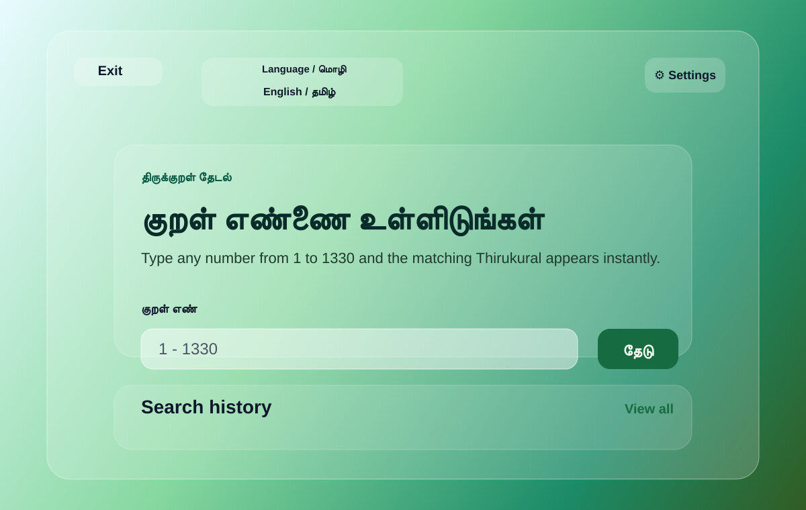
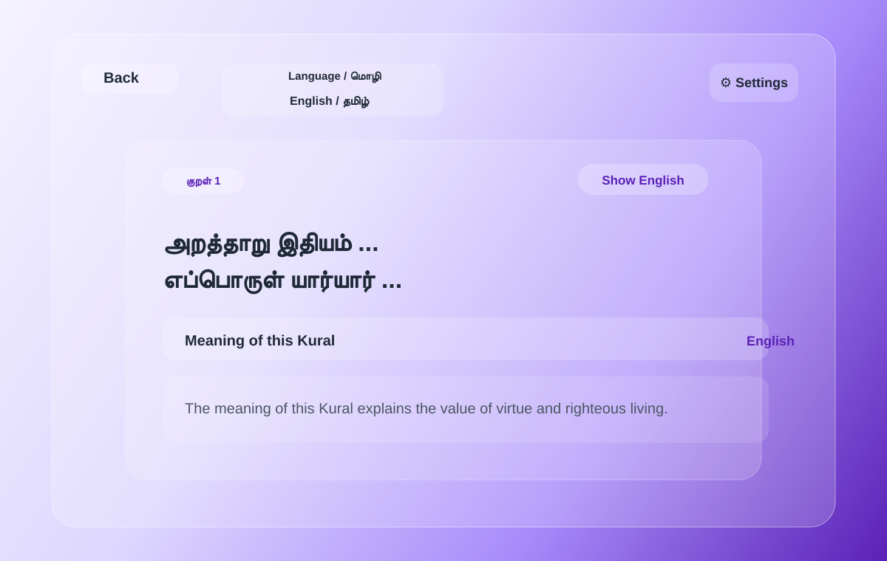

# Thirukural Finder

A mobile-friendly Flask app for searching any Thirukural by number from 1 to 1330.

## Project Overview

This project helps users quickly look up and read Thirukkural verses in Tamil, toggle between Tamil and English views, and explore the meaning of each Kural in a clean, modern interface. It is designed for simple browsing on both desktop and mobile screens.

## Features

- Flask API endpoint: `/api/kural/<number>`
- Mobile-first HTML, CSS, and JavaScript frontend
- Full local dataset with all 1330 Kurals
- Tamil Kural display by default
- English meaning toggle on the Kural page
- Tamil/English interface language switch
- Search history stored in the browser
- Clear history button
- Eight glass-style color themes with selected theme tick

## UI Screenshots

### Home screen



This screen allows the user to enter a Kural number and instantly search for the matching verse. The layout is simple, mobile-friendly, and includes search history for quick revisits.

### Kural detail page



This screen shows the selected Kural in Tamil, with an option to toggle English translation and view the meaning. It gives a focused reading experience for one verse at a time.

## Run

```bash
pip install -r requirements.txt
python app.py
```

Open:

```text
http://127.0.0.1:5000
```

## Rebuild Dataset

The CSV is already built, but you can regenerate it from the public source:

```bash
python build_thirukural_dataset.py
```

This creates:

- `thirukural_tamil.csv`
- `thirukural_tamil.json`

The app loads the CSV once when Flask starts, so searches are fast and do not need internet access.
