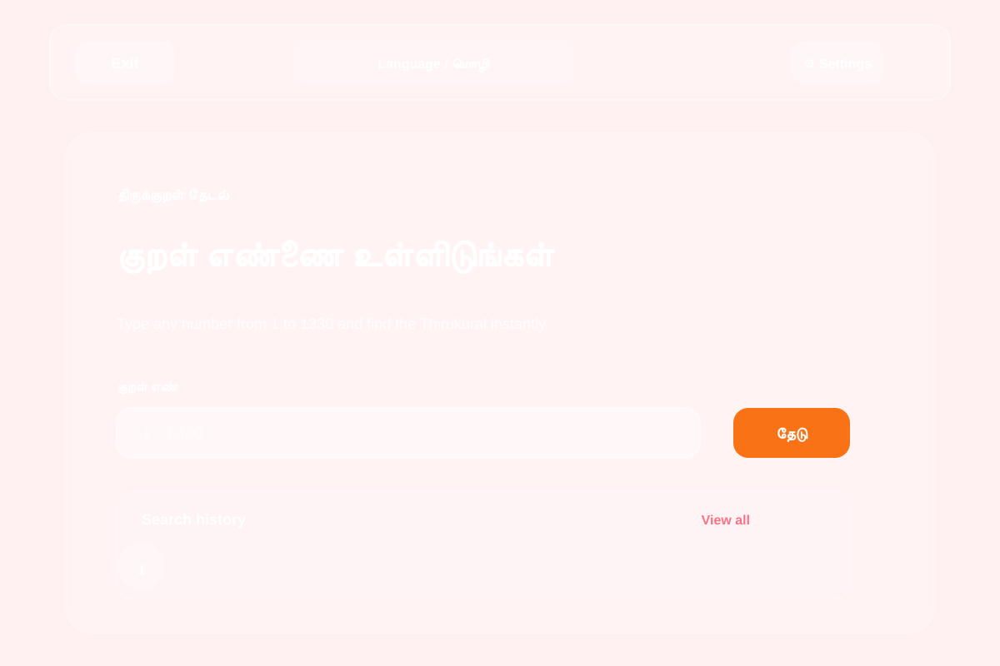
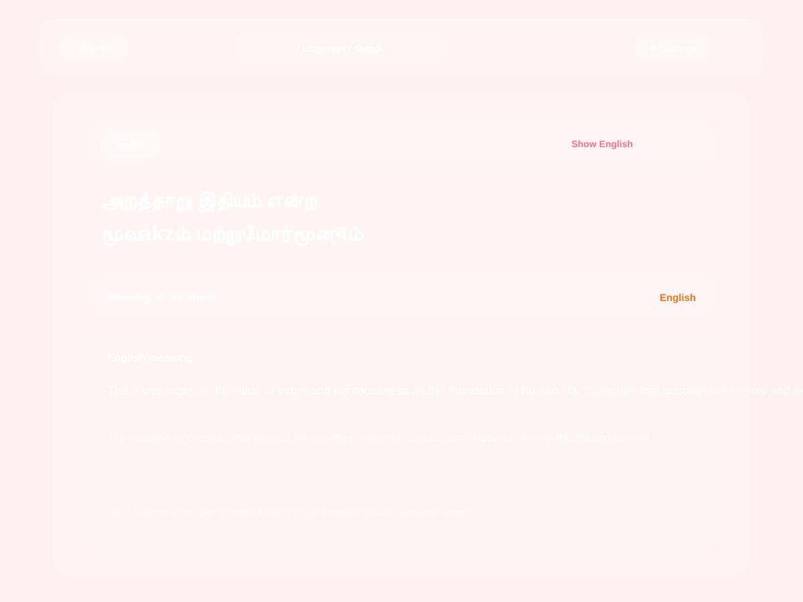

# Thirukural Finder

A mobile-friendly Flask app for searching any Thirukural by number from 1 to 1330.

## 🚀 Quick Start - How to Run

Follow these steps to run the app on your computer:

### Step 1: Install Python dependencies
```bash
pip install -r requirements.txt
```

### Step 2: Start the Flask app
```bash
python flask_app.py
```

You should see output like:
```
WARNING in flask.app: This is a development server. Do not use it in production.
Running on http://127.0.0.1:5000
```

### Step 3: Open the app in your browser
Click this link or paste it in your browser:
```
http://127.0.0.1:5000
```

That's it! The app will load and you can start searching for Kurals.

### Step 4: Stop the app (when done)
Press `Ctrl+C` in the terminal to stop the app.

---

## Project Overview

This project helps users quickly look up and read Thirukkural verses in Tamil, toggle between Tamil and English views, and explore the meaning of each Kural in a clean, modern interface. It is designed for simple browsing on both desktop and mobile screens.

## Features

- Flask API endpoint: `/api/kural/<number>`
- Mobile-first HTML, CSS, and JavaScript frontend
- Full local dataset with all 1330 Kurals
- Tamil Kural display by default
- English meaning toggle on the Kural page
- Tamil/English interface language switch
- Search history stored in the browser
- Clear history button
- Multiple glass-style color themes with selected theme tick

## Good starting Kurals

If you want a few well-known and meaningful choices to try first, the app works great with numbers like:

- 1
- 25
- 38
- 71
- 100
- 127

These are a few of the more memorable Kurals and make a nice starting point for exploring the collection.

## Project Structure

```text
Thirukural/
├── flask_app.py                 # Flask app entry point
├── requirements.txt            # Python dependencies
├── README.md                   # project documentation
├── .gitignore                  # ignores cache and editor files
├── thirukural_tamil.csv        # main Kural dataset used by the app
├── static/
│   ├── script.js               # theme, UI, and interaction logic
│   └── style.css               # layout and styling
├── templates/
│   ├── index.html              # home page for Kural lookup
│   └── kural.html              # Kural detail view
└── README-assets/              # optional local screenshots if added later
```

## User Interface (Fire & Ice Theme)

### Home Screen


**Description**: The search interface displays a clean, welcoming screen where you enter a Kural number (1-1330). The Fire & Ice theme uses warm reds and oranges blending into cool purples, creating a vibrant visual experience. Below the search box, your search history is automatically saved for quick access.

### Kural Detail Page


**Description**: When you select a Kural, this page shows the verse in Tamil text. You can toggle to see the English translation using the "Show English" button. The meaning section explains the Kural in your chosen language. Navigation arrows let you browse to the previous or next Kural easily.

## Run

See **Quick Start** section above for detailed step-by-step instructions.

Quick command:
```bash
pip install -r requirements.txt && python flask_app.py
```

Then open http://127.0.0.1:5000 in your browser.

## Technical Notes

- **Entry point**: `flask_app.py` (a clean, descriptive name for the Flask application)
- **Debug mode**: Disabled for production safety
- **Dependencies**: Only Flask is required (removed unused `requests`)
- **Data source**: Uses CSV format for fast local loading without external dependencies
- **Color themes**: 15+ glass-style themes including Fire & Ice, Sunset Garden, and Forest Glow
